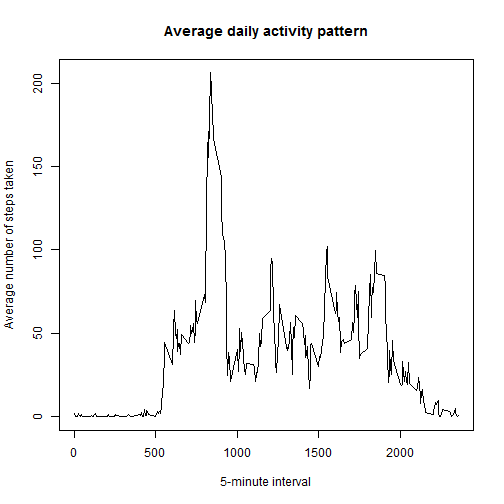

# **Week 2 assignment**


***Loading and Preprocessing data***

Assuming the file has been downloaded to the working directory.

Reading the data into a dataframe.

```r
activity <- read.csv("activity.csv", stringsAsFactors=FALSE)
```

###Mean total number of steps taken per day

Preprocessing the data to remove the NAs for this part of assignment.

```r
activity_noNA <- na.omit(read.csv("activity.csv", stringsAsFactors=FALSE))
activity_noNA$date <- as.Date(activity_noNA$date)
```

***Total number of steps taken per day***


```r
library(plyr)
```

```
## Warning: package 'plyr' was built under R version 3.1.3
```

```r
steps_per_day <- ddply(activity_noNA, .(date), summarize, total_steps=sum(steps))
library(knitr)
print(kable(steps_per_day, format="markdown", align="l", padding=0, row.names=NA, caption="Steps taken per day"))
```

```
## 
## 
## |date      |total_steps|
## |:---------|:----------|
## |2012-10-02|126        |
## |2012-10-03|11352      |
## |2012-10-04|12116      |
## |2012-10-05|13294      |
## |2012-10-06|15420      |
## |2012-10-07|11015      |
## |2012-10-09|12811      |
## |2012-10-10|9900       |
## |2012-10-11|10304      |
## |2012-10-12|17382      |
## |2012-10-13|12426      |
## |2012-10-14|15098      |
## |2012-10-15|10139      |
## |2012-10-16|15084      |
## |2012-10-17|13452      |
## |2012-10-18|10056      |
## |2012-10-19|11829      |
## |2012-10-20|10395      |
## |2012-10-21|8821       |
## |2012-10-22|13460      |
## |2012-10-23|8918       |
## |2012-10-24|8355       |
## |2012-10-25|2492       |
## |2012-10-26|6778       |
## |2012-10-27|10119      |
## |2012-10-28|11458      |
## |2012-10-29|5018       |
## |2012-10-30|9819       |
## |2012-10-31|15414      |
## |2012-11-02|10600      |
## |2012-11-03|10571      |
## |2012-11-05|10439      |
## |2012-11-06|8334       |
## |2012-11-07|12883      |
## |2012-11-08|3219       |
## |2012-11-11|12608      |
## |2012-11-12|10765      |
## |2012-11-13|7336       |
## |2012-11-15|41         |
## |2012-11-16|5441       |
## |2012-11-17|14339      |
## |2012-11-18|15110      |
## |2012-11-19|8841       |
## |2012-11-20|4472       |
## |2012-11-21|12787      |
## |2012-11-22|20427      |
## |2012-11-23|21194      |
## |2012-11-24|14478      |
## |2012-11-25|11834      |
## |2012-11-26|11162      |
## |2012-11-27|13646      |
## |2012-11-28|10183      |
## |2012-11-29|7047       |
```

***Histogram of total number of steps taken per day***


```r
hist(steps_per_day$total_steps, xlab="Total steps per day", main="Histogram of total steps per day")
```

 

***Mean and Median of the total number of steps taken per day***


```r
activity_mean <- mean(steps_per_day$total_steps)
activity_median <- median(steps_per_day$total_steps)
```
* Mean of total number of steps taken per day is 1.0766189 &times; 10<sup>4</sup> 

* Median of total number of steps taken per day is 10765

###Average daily activity pattern


***Time series plot of the 5-minute interval and the average number of steps taken averaged across all days***


```r
average_data <- aggregate(activity_noNA$steps, by=activity_noNA["interval"], FUN=mean)
plot(average_data$interval, average_data$x, type="l", xlab="5-minute interval", ylab="Average number of steps taken", main="Average daily activity pattern")
```

 

***5-minute interval averaged across all the days in the dataset containing maximum number of steps***


```r
max_interval <- average_data[average_data$x==max(average_data$x), 1]
```

The 835th interval on average contains the maximum number of steps.


###Imputing missing values


***Total number of missing values in the dataset***

The original dataset included the NAs as well, subtracting the number of rows of the non-NA dataset from that of the original dataset gives the number of rows with NAs. 

```r
missing_values <- nrow(activity) - nrow(activity_noNA)
```
Total number of rows with NAs is 2304

***Filling in all of the missing values in the dataset***

Filling in the missing values with the average for that 5-minute interval. For that combining the average dataset with the activity dataset. 


```r
all_activity_with_average <- join(activity, average_data, type="inner", by ="interval")
```

***New dataset that is equal to the original dataset but with the missing data filled in***

Filling in the steps in the combined dataset for NAs with average.

```r
all_activity_with_average$steps <- with(all_activity_with_average, ifelse(!is.na(steps), steps, x))
```

***Histogram of the total number of steps taken each day***


```r
steps_per_day_all <- ddply(all_activity_with_average, .(date), summarize, total_steps=sum(steps))
activity_mean_all <- mean(steps_per_day_all$total_steps)
activity_median_all <- median(steps_per_day_all$total_steps)
hist(steps_per_day_all$total_steps, xlab="Total steps per day NAs filled in", main="")
```

 

***Mean and Median total number of steps taken per day***

* Mean of total number of steps taken per day with NAs filled in is 1.0766189 &times; 10<sup>4</sup> 

* Median of total number of steps taken per day with NAs filled in is 1.0766189 &times; 10<sup>4</sup>

The mean and median values remain nearly the same after filling in the NAs. The total daily steps value remains the same for most of the data except for the central values which gets increased because NAs were filled in with the central(average) values. 

***Impact of imputing missing data on the estimates of the total daily number of steps***

Here's the comparison of the two in the plot.


```r
par(mfrow=c(1,2))
hist(steps_per_day_all$total_steps, xlab="Total steps per day NAs filled in", main="")
hist(steps_per_day$total_steps, xlab="Total steps per day", main="")
```

 

###Differences in activity patterns between weekdays and weekends


***Creating a new factor variable in the dataset with two levels - "weekday" and "weekend" indicating whether a given date is a weekday or weekend day.***

Adding the new factor variable WeekDay to the dataset that indicates if it is a weekend or a weekday.

```r
all_activity_with_average$WeekDay <- weekdays(as.Date(all_activity_with_average$date))
all_activity_with_average$WeekDay <- with(all_activity_with_average, ifelse(WeekDay == "Sunday" | WeekDay == "Saturday", "weekend", "weekday"))
all_activity_with_average$WeekDay <- as.factor(all_activity_with_average$WeekDay)
```

***Panel plot containing a time series plot of the 5-minute interval and the average number of steps taken, averaged across all weekday days or weekend days***

```r
library(ggplot2)
```

```
## Warning: package 'ggplot2' was built under R version 3.1.3
```

```r
ggplot(all_activity_with_average, aes(x=interval, y=x)) + geom_bar(stat="identity") + facet_grid(.~WeekDay) + xlab("Interval") + ylab("Average No of steps")
```

 
